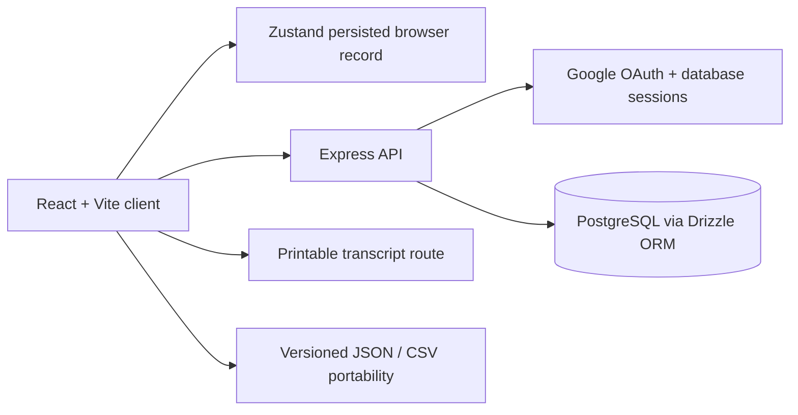

# SUST GPA

> A focused academic record workspace for SUST students to calculate GPA, understand CGPA progression, and keep a polished transcript-ready record.

[Live application](https://sust-gpa-1.onrender.com) · [Source repository](https://github.com/almuyed-saad/sust-gpa)

SUST GPA is a production-deployed GPA tracker built for students at **Shahjalal University of Science and Technology (SUST), Bangladesh**. It combines a fast local-first experience with optional Google-authenticated cloud synchronization, so a student can begin recording results immediately and later access the same academic record across devices.

The project is intentionally scoped as a strong portfolio product rather than an oversized academic information system. Its value comes from the complete product loop: a clear responsive interface, dependable GPA calculations, persisted records, authentication, data portability, printable output, accessible interactions, and automated validation of security boundaries.

## Product overview

A student creates semesters, enters courses and credits, records marks or selects a grade override, and receives continuously updated semester GPA and cumulative GPA calculations. Semester metadata such as academic year, term number, completion status, and notes makes the record useful beyond a single calculation screen.

The app works without login through browser persistence. When the user signs in, the application does not silently overwrite either side of a local/cloud conflict. Instead, it presents an explicit resolution dialog with merge, local, cloud, and browser-only choices. This local-first behavior protects a student’s in-progress work while still making cloud synchronization practical.

## Core capabilities

| Capability | What it provides |
|---|---|
| GPA and CGPA calculation | Weighted semester GPA, cumulative GPA, total credits, and progression summaries. |
| SUST grading scale | Mark-to-grade conversion for the configured public-university scale, from A+ / 4.00 through F / 0.00. |
| Semester organization | Academic year, term number, completed or in-progress status, notes, collapse controls, and course counts. |
| Course editing | Course name, credits, marks, grade override, grade points, add/remove actions, and responsive mobile editing. |
| GPA target planner | A forward-looking planner that estimates the GPA required to reach a target CGPA. |
| Progress visualization | A semester-by-semester GPA chart for understanding academic progression. |
| Multi-theme interface | Light, dark, ocean, and sunset palettes with keyboard-accessible selection and reduced-motion support. |
| Local-first persistence | Records remain available in the browser before authentication and during ordinary offline-style editing. |
| Google sign-in and cloud sync | Database-backed sessions and per-user semester/course storage across devices. |
| Safe sync resolution | Explicit merge, local, cloud, or browser-only choices after authentication when records differ. |
| Data portability | Versioned JSON backup/import and CSV export for ownership and reuse of academic data. |
| Printable transcript | A dedicated `/transcript` route with metrics, semester tables, course details, and print styles. |
| Inline validation | Non-blocking guidance for missing course names, invalid credits or marks, incomplete results, and duplicate semester names. |
| Accessible interaction design | Named controls, associated labels, visible focus states, semantic dialogs, keyboard theme navigation, and mobile-friendly targets. |

## Why this is a meaningful portfolio project

SUST GPA demonstrates more than a static form or a calculator. It addresses realistic product concerns while remaining understandable:

1. **Data integrity:** GPA calculations are deterministic, and grade entry supports both mark-based conversion and manual grade overrides.
2. **User trust:** Local and cloud records are never silently replaced after sign-in; the user chooses how to resolve conflicts.
3. **Privacy boundaries:** Protected API routes scope semester and course access to the authenticated user, with automated tests for cross-user isolation.
4. **Progressive enhancement:** The core tracker works locally, while authentication, cloud storage, portability, and printing add practical depth.
5. **Production discipline:** The project uses typed workspaces, additive database migration patterns, repeatable validation commands, Git-based deployment, and live health checks.

## Architecture



The repository is organized as a pnpm workspace. The frontend is built with React and Vite. The API server is an Express application that mounts authentication and GPA routes under `/api`. PostgreSQL stores users, sessions, semesters, and courses. Drizzle ORM provides typed schema access, while the runtime migration uses additive `ALTER TABLE ... ADD COLUMN IF NOT EXISTS` statements for the current semester metadata.

### Main request and storage flow

| Layer | Responsibility |
|---|---|
| `artifacts/gpa-calculator` | React interface, routing, themes, local persistence, charts, transcript view, sync resolution, and portability controls. |
| `artifacts/api-server` | Express app, Google OAuth callbacks, session middleware, protected GPA CRUD routes, health endpoint, and production static-file serving. |
| `lib/db` | Drizzle PostgreSQL schema, database connection, retry helper, and database exports. |
| `lib/api-zod` | Runtime request/response validators and shared API types. |
| `scripts` | Deterministic GPA, backup, metadata, and synchronization regression checks. |

## Repository structure

```text
.
├── artifacts/
│   ├── api-server/              # Express API and authentication
│   └── gpa-calculator/          # React/Vite frontend
├── lib/
│   ├── api-zod/                 # Shared API validation/types
│   └── db/                      # Drizzle schema and database access
├── scripts/                     # Regression and validation harnesses
├── .env.example                 # Local environment template
├── render.yaml                  # Render deployment manifest
├── package.json                 # Workspace scripts and pinned package manager
└── pnpm-workspace.yaml          # Workspace package definitions
```

## Technology stack

| Area | Technology |
|---|---|
| Frontend | React, TypeScript, Vite, Tailwind CSS, Zustand, Wouter, Framer Motion, Recharts, Lucide icons |
| Backend | Node.js, Express 5, TypeScript, OpenID Client |
| Data layer | PostgreSQL, Drizzle ORM, Neon serverless driver |
| Validation | Zod-based shared API schemas and client-side inline feedback |
| Authentication | Google OAuth 2.0 with database-backed sessions |
| Testing | Vitest, Supertest, Node assertions, TypeScript checks, production builds |
| Deployment | Render web service with the Express server serving the built frontend |

## GPA grading scale

The current calculation model uses the configured SUST-oriented public-university scale below. The scale is centralized in the frontend GPA utilities and covered by regression tests.

| Marks | Grade | Grade points |
|---:|:---:|---:|
| 80–100 | A+ | 4.00 |
| 75–79 | A | 3.75 |
| 70–74 | A- | 3.50 |
| 65–69 | B+ | 3.25 |
| 60–64 | B | 3.00 |
| 55–59 | B- | 2.75 |
| 50–54 | C+ | 2.50 |
| 45–49 | C | 2.25 |
| 40–44 | D | 2.00 |
| Below 40 | F | 0.00 |

Semester GPA is calculated as the credit-weighted average of graded courses. CGPA is calculated across the complete graded record, so incomplete courses remain visible without being treated as completed results.

## Local development

### Prerequisites

Use **Node.js 20–22** and **pnpm 10.15.1**. The repository declares the expected Node range and package manager version in the root `package.json`.

### 1. Clone and install

```bash
git clone https://github.com/almuyed-saad/sust-gpa.git
cd sust-gpa
corepack enable
corepack prepare pnpm@10.15.1 --activate
pnpm install
```

If Corepack is unavailable in a local environment, install pnpm 10.15.1 through the preferred Node package-management method and confirm it with `pnpm --version`.

### 2. Configure environment variables

Copy the template and provide local values:

```bash
cp .env.example .env
```

| Variable | Purpose |
|---|---|
| `DATABASE_URL` | PostgreSQL connection string used by Drizzle and session storage. |
| `GOOGLE_CLIENT_ID` | Google OAuth web client ID. |
| `GOOGLE_CLIENT_SECRET` | Google OAuth client secret; keep it outside Git. |
| `SESSION_SECRET` | Long random value used to protect sessions; keep it outside Git. |

For local OAuth, configure the Google client callback URL as:

```text
http://localhost:3000/api/auth/google/callback
```

The production callback must use the deployed application’s `/api/auth/google/callback` path. OAuth secrets should be configured in the deployment platform’s secret manager and never committed to the repository.

### 3. Start the application

Run the API and frontend in separate terminals:

```bash
# Terminal 1: API server
pnpm --filter @workspace/api-server run dev

# Terminal 2: Vite frontend
pnpm --filter @workspace/gpa-calculator run dev
```

The Vite development server is normally available at `http://localhost:5173`. The API server listens on its configured port and exposes the health check at `/api/healthz`.

## Validation and testing

The root test command runs both the deterministic GPA regression harness and the authenticated API suite:

```bash
pnpm test
```

The API suite uses request-level assertions with isolated mocked sessions and storage. It verifies unauthenticated `401` behavior, authenticated CRUD, per-user collection filtering, and attempts to read, update, create under, or delete another user’s records.

Run the complete local release checks with:

```bash
pnpm test
pnpm typecheck
pnpm build
```

The production frontend is code-split by route and by heavier vendor dependencies. The dashboard, transcript, charting, animation, and icon code are emitted as cacheable chunks rather than one eagerly loaded JavaScript entry. The remaining build output should be reviewed as dependencies evolve.

## Deployment

The live application is deployed at [https://sust-gpa-1.onrender.com](https://sust-gpa-1.onrender.com). Render builds the frontend and API, then starts the bundled Express server:

```text
Build: pnpm install && pnpm --filter @workspace/gpa-calculator run build && pnpm --filter @workspace/api-server run build
Start: node artifacts/api-server/dist/index.cjs
```

The Express server serves the built frontend in production, which keeps the public deployment simple while allowing `/`, `/transcript`, and `/api/*` to share one origin. After a deployment, the basic smoke checks are:

```bash
curl -i https://sust-gpa-1.onrender.com/
curl -i https://sust-gpa-1.onrender.com/transcript
curl -i https://sust-gpa-1.onrender.com/api/healthz
```

## API surface

All GPA CRUD endpoints require an authenticated session. Ownership checks are applied to semester and course queries so a user cannot operate on another user’s records by guessing an ID.

| Method | Route | Purpose |
|:---:|---|---|
| `GET` | `/api/healthz` | Service health check. |
| `GET` | `/api/auth/user` | Return the current authenticated user or an unauthenticated response. |
| `GET` | `/api/semesters` | List the current user’s semesters and courses. |
| `POST` | `/api/semesters` | Create a semester with an initial course row. |
| `PUT` | `/api/semesters/:semesterId` | Update owned semester metadata. |
| `DELETE` | `/api/semesters/:semesterId` | Delete an owned semester. |
| `POST` | `/api/semesters/:semesterId/courses` | Add a course to an owned semester. |
| `PUT` | `/api/semesters/:semesterId/courses/:courseId` | Update an owned course. |
| `DELETE` | `/api/semesters/:semesterId/courses/:courseId` | Delete an owned course. |

## Data synchronization model

Local browser data is persisted through the GPA store. Cloud data is persisted per authenticated user. After sign-in, the sync-resolution hook compares meaningful local and cloud records for the current session.

When both records contain meaningful data, the user chooses one of four actions: merge both records, use the browser record, use the cloud record, or keep the browser record only. The merge process matches semesters by academic year, term number, and name, then deduplicates courses using course name, credits, marks, and grade letter. Completed status wins, and a non-empty local note is retained when both sides contain notes.

Resolution is tracked in session storage for the current user and browser session. A later session can review a new difference again rather than permanently suppressing the decision.

## Scope and known limitations

SUST GPA is designed for an individual student’s academic record, not as a university registrar or multi-role administrative system. It does not attempt to manage course registration, official transcript verification, degree audits, notifications, payments, or institutional integrations.

Cloud replacement during local/cloud resolution currently recreates records through the existing CRUD API sequentially. The interface reports errors clearly and supports retry, but a failure during a long replacement could leave a partial remote recreation. A future bulk transactional endpoint could harden that flow further without changing the user-facing model.

The accessibility work is targeted product QA rather than a formal WCAG certification. The app includes semantic labels, focus treatment, keyboard behavior, reduced-motion handling, responsive layouts, and live DOM checks, but accessibility should continue to be reviewed as new features are added.

## Portfolio highlights

This project is a useful demonstration of full-stack product ownership: the calculation domain is isolated and tested, the interface is responsive and themed, authentication and persistence are real, data migration is additive, API ownership boundaries are automated, and deployment is verified against a live service. The result is intentionally compact enough to understand while showing the decisions expected in a production-minded portfolio project.

## References and documentation

- [React documentation](https://react.dev/)
- [Vite documentation](https://vite.dev/)
- [Express documentation](https://expressjs.com/)
- [Drizzle ORM documentation](https://orm.drizzle.team/)
- [Render documentation](https://render.com/docs)
- [Google OAuth documentation](https://developers.google.com/identity/protocols/oauth2)
